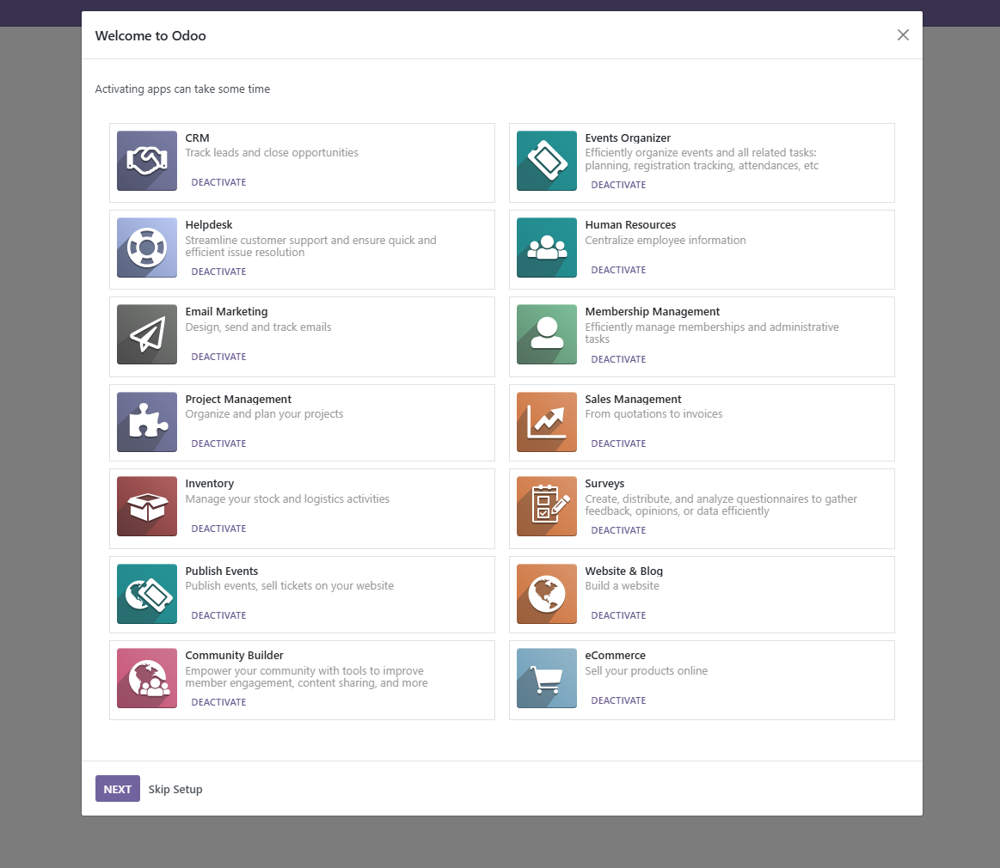

[](https://github.com/onesteinbv/addons-container/actions/workflows/pre-commit.yml)
[](https://demo.curq.nl/web/login)

# CURQ

CURQ is an all-in-one platform for businesses, built on Odoo and other open-source projects.

It’s a highly opinionated, purpose-built solution tailored specifically for Dutch companies. 
The goal is to provide a complete, ready-to-use package so businesses don’t need a consultant to decide which modules to install.
CURQ streamlines both the installation and support process by combining Odoo, OCA, and other open-source modules into curated bundles.

## Bundles

In CURQ, bundles are a set of predefined modules that simplify the installation of Odoo, you don't need to know
exactly which modules exist or which ones to install individually. For example, the essential bundle (`container_install`) includes 
a collection of modules that are commonly required for every installation. Instead of installing each module manually, 
you can install them all with a single click. Technically, a bundle is a standard Odoo module that only contains dependencies to 
other modules, nothing else.

- **Essentials Installation** (`container_install`): Installs essential modules
- **Accounting** (`account_install`): Invoices, Contracts & Payments
- **CRM** (`crm_install`): Track leads and close opportunities
- **Event organizer** (`event_install`): Efficiently organize events and all related tasks: planning, 
  registration tracking, attendances, etc
- **Helpdesk** (`helpdesk_install`): Streamline customer support and ensure quick and efficient issue resolution
- **Human Resources** (`hr_install`): Centralize employee information
- **Email Marketing** (`mass_mailing_install`): Design, send, and track emails
- **Membership Management** (`membership_install`): Efficiently manage memberships and administrative tasks
- **Project Management** (`project_install`): Organize and plan your projects 
- **Sales Management** (`sale_install`): Sales process from quotations to invoices
- **Inventory** (`stock_install`): Manage your stock and logistics activities
- **Surveys** (`survey_install`): Create, distribute, and analyze questionnaires to gather feedback, opinions, or data 
  efficiently
- **Publish Events** (`website_event_install`): Publish events, and sell tickets on your website
- **Website & Blog** (`website_install`): Build a website
- **Community Builder** (`website_membership_install`): Empower your community with tools to improve member engagement,
  content sharing, and more
- **eCommerce** (`website_sale_install`): Sell your products online



## Creating new bundles

Creating a bundle is simple. Just add the flag: `bundle: True` to the module's `__manifest__.py` file. This ensures that all dependencies listed in `depends` 
are automatically uninstalled when the bundle is uninstalled. However, dependencies are only uninstalled if they are not required by any other installed 
bundle. For example, both `website_install` and `website_sale` depend on the website module. If both bundles are installed and you uninstall `website_install`, the `website` 
module will not be removed, because it’s still needed by `website_sale`.

## GIT Aggregator

CURQ uses [git-aggregator](https://github.com/acsone/git-aggregator) to fetch modules from various sources.
To simplify maintenance, CURQ uses a consolidated copy of OCA modules hosted at: [onesteinbv/addons-oca](https://github.com/onesteinbv/addons-oca).
This avoids the need to include every individual OCA repository and required pull requests in the `repo.yaml` which
would be tedious and error-prone. In addition, CURQ includes modules from  [onesteinbv/addons-generic](https://github.com/onesteinbv/addons-generic). These are mostly 
generic modules that have not (yet) been proposed to the OCA, or are considered uninteresting for the OCA.

## Module packaging (package.txt)

Modules aggrated via `git-aggregator` are **not** automatically included in the 
[CURQ image](https://github.com/onesteinbv/addons-curq/pkgs/container/curq). To control which modules are
bundled into the image, CURQ uses a `package.txt` file.

## Maintenance scripts

After installing or updating Odoo (whether using `$MODE` as `Install`, `Init` or `Update`), it will automatically run `scripts/run.sh`. This script performs several setup and housekeeping tasks to ensure the system is properly configured and ready to use.

## Resources

- [Documentation](https://docs.curq.nl)
- [Get involved](https://curq.nl/en/doe-mee)
- [Bug tracker](https://github.com/onesteinbv/addons-curq/issues)
- [Updates](https://curq.nl/en/blog)
- [Release Notes](https://github.com/onesteinbv/addons-curq/releases)

## Docker

This image is based on https://github.com/onesteinbv/odoo-docker.
Most configuration options and environment variables are documented there.
One key variable to note is `MODE`, which determines how Odoo is started and is essential to the image's behavior.

## Quick Start

```sh
git clone git@github.com:onesteinbv/addons-curq.git
cd addons-curq
docker compose up
```

It's **recommended** to also run [watchtower](https://github.com/containrrr/watchtower) to automically get updates.

Default credentials for Curq are:
- **Email:** admin
- **Password:** admin

## License

This project is licensed under [AGPL-3.0](LICENSE). Although externally linked / used Odoo modules can have different licenses.
